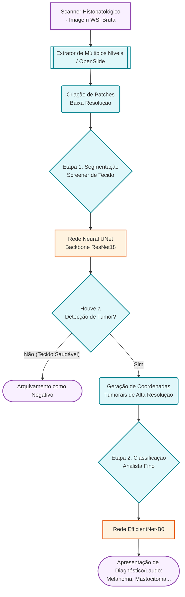
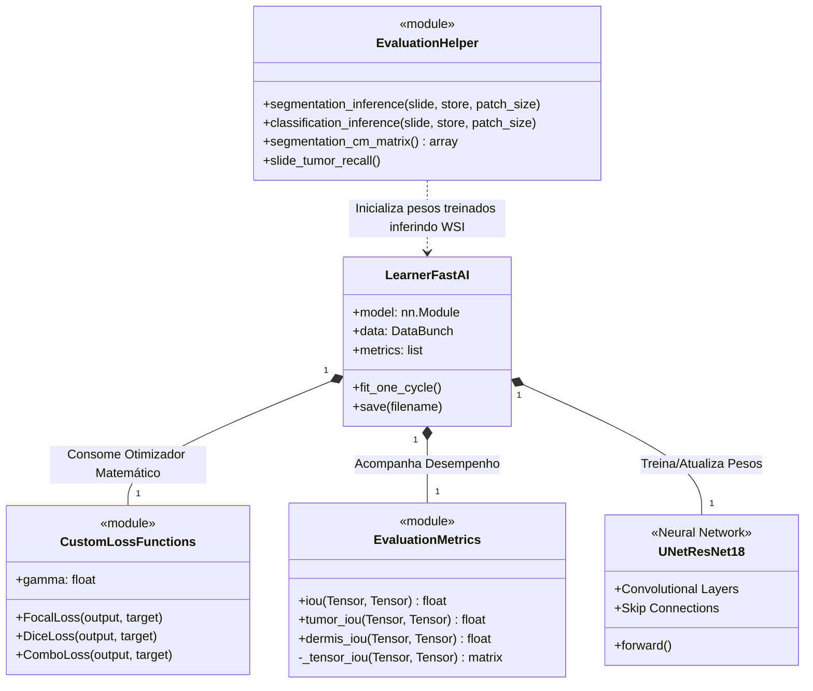
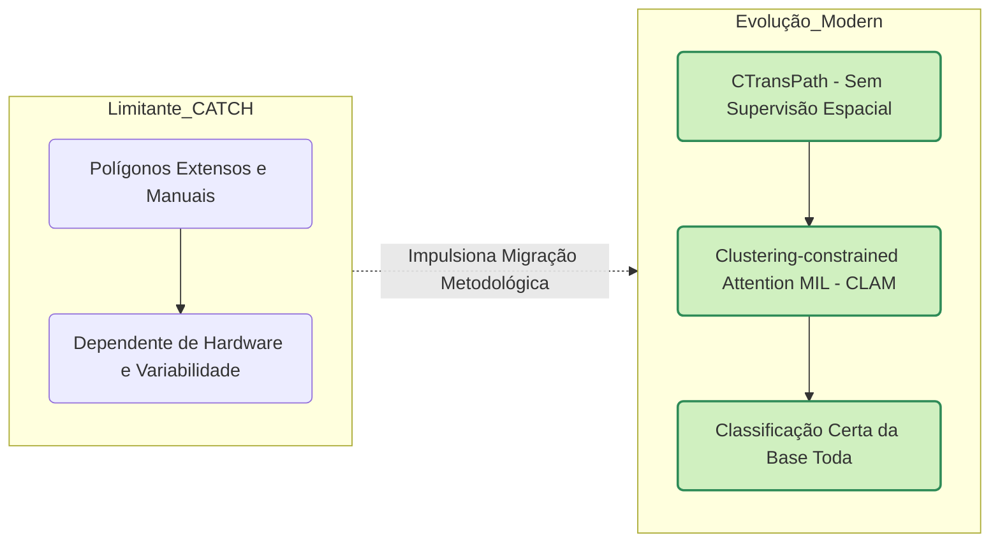

# Especificações de Engenharia de Software e Modelagem (CATCH)

Este documento centraliza os requisitos sistêmicos, os Casos de Uso (Study Cases) e as abstrações arquiteturais do pipeline de Aprendizado Profundo original referenciado pelo Dataset CATCH. A documentação estabelece o alicerce para análise da refatoração presente na abordagem `modern/`.

---

## 1. Requisitos do Sistema

### 1.1 Requisitos Funcionais (RF)
- **RF01 - Ingestão de WSIs:** O sistema deve ser capaz de carregar e processar Imagens de Lâminas Inteiras (Whole Slide Images) nos formatos piramidais prevalentes na patologia digital (e.g., `.svs`, `.tiff`, `.ndpi`).
- **RF02 - Conversão de Anotações:** O sistema deve prover componentes (módulos) para conversão contínua entre formatos de anotação de especialistas, suportando XML, máscaras exatas e banco de dados SQL (via `annotation_conversion/`).
- **RF03 - Segmentação de Tecidos:** O sistema deve executar a segmentação semântica pixel a pixel, discriminando as zonas patológicas primárias (tumor, derme saudável, epiderme, inflamação celular) usando uma arquitetura ConvNet.
- **RF04 - Predição e Classificação Tumoral:** O sistema deve abstrair frações retangulares (*patches*) extraídas das áreas marcadas como neoplasias na etapa anterior e classificá-las objetivamente em uma das sete classes de tumores cutâneos (Melanoma, Mastocitoma, SCC, etc).
- **RF05 - Reconstrução de Inferência (Slide Runner):** O sistema deve compilar as anotações inferidas de milhares de matrizes novamente para o espaço dimensional da Lâmina para apresentação visual via plugins do *SlideRunner*.

### 1.2 Requisitos Não-Funcionais (RNF)
- **RNF01 - Reprodutibilidade (DevOps):** O sistema deve rodar perfeitamente isolado independentemente da máquina host, via ambientes Docker Multi-Stage nativos de C/C++ vinculados às acelerações gráficas.
- **RNF02 - Desempenho GPU-Bound:** O treinamento e a inferência devem executar seus cálculos de tensores predominantemente em placas de vídeo via API CUDA, desonerando o microprocessador geral.
- **RNF03 - Estabilidade Numérica de Gradientes:** O cálculo das rotinas de otimização (tais como a Dice Loss modificada) não deve disparar *Gradient Exploding*, tolerando minimamente inconsistências ou vazios no lote da inferência.
- **RNF04 - Prevenção de Memory Leaks:** Em varreduras de WSIs densas (maiores que 40K x 40K pixels), o pipeline analítico de extração deve executar a liberação rigorosa e forçada do cache tensor iterativo (explicit `garbage collection`) para prevenir travamentos (`OOM - Out of Memory`).

---

## 2. Estudos de Caso (Use Cases)

### Caso de Uso 01: Treinamento CATCH Supervisionado (Patologista / Cientista de Dados)
**Ator:** Pesquisador, IA Engineer.
**Pré-condição:** Imagens WSIs originais rotuladas e baixadas do TCIA (The Cancer Imaging Archive).
**Fluxo Principal:**
1. O Pesquisador inicializa o contêiner Docker contendo as dependências Pytorch/OpenSlide.
2. O ator converte os polígonos manuais para vetores computacionais processáveis pelos scripts da pasta `annotation_conversion/`.
3. O modelo fraciona as imagens com base nas demarcações (criando datasets explícitos positivos/negativos por coordenadas fixas).
4. Ocorre o loop de treinamento da *UNet*, processando as máscaras na segmentação principal.
5. As métricas convergem, salvas no arquivo `/models/unet_weights.pth`.

### Caso de Uso 02: Avaliação de Biópsia e Diagnóstico Clínico (Pipeline de Inferência)
**Ator:** Sistema Clínico / Analista.
**Pré-condição:** Lâmina canina não vista (Test Set) extraída por scanner digital, e Pesos pré-treinados instanciados.
**Fluxo Principal:**
1. O sistema clínico aciona o `slide_inference.ipynb`.
2. A Lâmina sofre leitura piramidal. A `UNet` examina as resoluções brutas separando a derme de anomalias (gerando heatmap de tumor).
3. Apenas dentro das "bolhas" do tumor geradas pela rede anterior, recortes refinados sofrem varredura pelo segundo algoritmo classificador (`EfficientNet-B0`).
4. A rede final emite o laudo preditivo (ex: Mastocitoma) com taxa de confidência associada ao tecido.

---

## 3. Diagramas Arquiteturais (UML e Fluxo)

Abaixo seguem os diagramas representativos exportados em linguagem estruturada (Mermaid). 

### 3.1 Diagrama de Fluxo (Pipeline de Diagnóstico - CATCH Baseline)

### 3.2 Diagrama de Classes e Módulos (CATCH Engine)

### 3.3 Diagrama de Componentes Modernos (Preparação para SOTA)

*(Visão arquitetural antecessora que justificou transicionar da Baseline acima para a estrutura Modern via MIL).*

