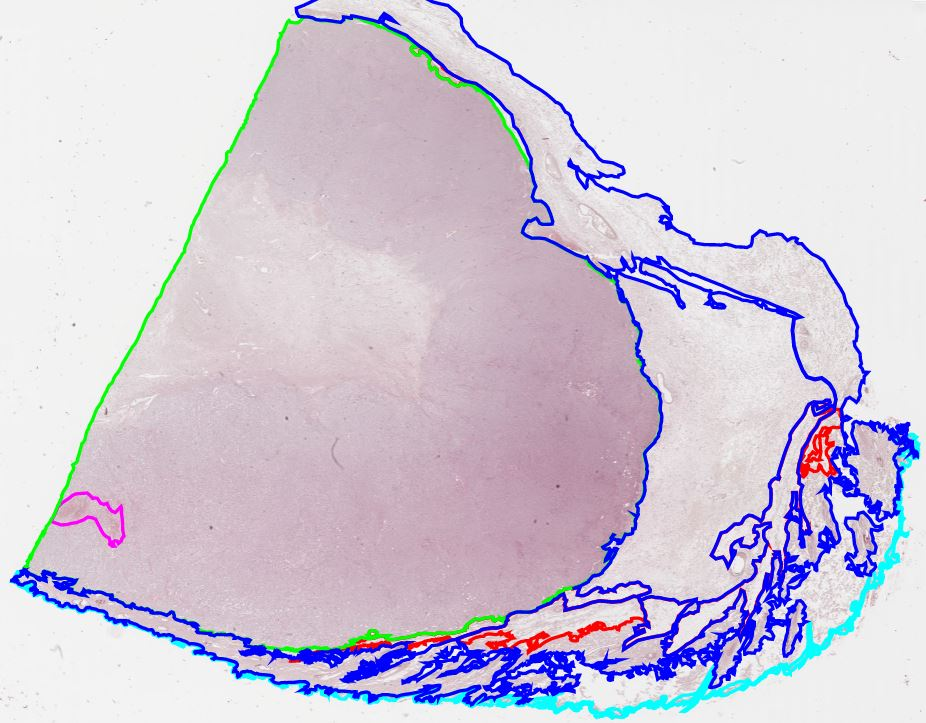

<p align="center">
  
</p>

<h1 align="center">O.X.T.A Pathology: IA Avançada no Diagnóstico de Tumores Cutâneos Caninos</h1>

<div align="center">

  [](https://github.com/vitorGgC569/CanineCutaneousTumors)
  [](https://opensource.org/licenses/MIT)
  [](https://www.python.org/)
  [](https://pytorch.org/)
  [](https://www.docker.com/)

</div>

---

## 🔬 Visão Geral do Projeto

Este repositório documenta a evolução e a pesquisa contínua no campo da patologia digital veterinária, com foco específico na implementação de algoritmos de Inteligência Artificial precursores e do estado-da-arte (SOTA) para o diagnóstico automatizado de neoplasias na pele de cães.

As afecções do sistema tegumentar representam uma das principais causas de consulta na clínica veterinária. O diagnóstico microscópico padrão-ouro depende diretamente da histopatologia corada por Hematoxilina e Eosina (H&E). Contudo, a análise manual de Imagens de Lâminas Inteiras (Whole Slide Images - WSIs) é extremamente árdua, suscetível a variabilidades e morosa. O propósito deste projeto é pavimentar um fluxo computacional (pipeline) exato, reprodutível e com gradiente de alta performance capaz de auxiliar patologistas na detecção, segmentação e classificação destas patologias tumorais com acurácia a níveis sobre-humanos.

O repositório é bifurcado em duas frentes metodológicas cruciais:
1. **A Diretriz Clássica Supervisionada (A Baseline `CATCH/`)**: Baseada na metodologia original do histórico dataset CATCH.
2. **A Diretriz do Estado-da-Arte (A Inovação `modern/`)**: Nossa principal rota de investigação atual, introduzindo *Multiple Instance Learning* (MIL) e *Foundation Models* para superação de gargalos de anotação humana.

---

## 🧬 O Dataset CATCH e a Arquitetura Baseline

A abordagem tradicional de aprendizado profundo (Deep Learning) em visão computacional médica sempre demandou que especialistas realizassem anotações ricas, lentas e densas — desenhando polígonos milimétricos em torno de cada agrupamento celular maligno presente numa placa WSI gigapixel.

Em 2022, de forma revolucionária para a medicina veterinária, foi inaugurado o **Dataset CATCH** (CAnine cuTaneous Cancer Histology). Este conjunto formidável disponibiliza 350 WSIs com resoluções formidáveis anotadas rigorosamente sobre sete subtipos tumorais cruciais: Melanoma, Mastocitoma (MCT), Carcinoma de Células Escamosas (SCC), Tumor da Bainha do Nervo Periférico (PNST), Tricoblastoma, Histiocitoma e Plasmocitoma.

### 🛡️ Por que o CATCH é a nossa Baseline?

Toda pesquisa científica computacional madura exige um ponto de ancoragem sólido (`Baseline`). Selecionamos os scripts de modelagem originais dos autores do dataset CATCH por três diretrizes essenciais:
1. **Validação Cruzada Publicada**: A metodologia `CATCH` já possui métricas aferidas e revisadas por pares na literatura, agindo como nossa "régua" de sanidade laboratorial.
2. **Arquitetura Bifásica (Segmentação + Classificação)**: O modelo base é lógico e interpretável. Primeiro ele tenta dissecar o *Tecido* do Fundo e o *Tumor* do Tecido Saudável através de uma rede **UNet com backbone ResNet18**. Posteriormente, pequenas frações (`patches`) dessa área perigosa são repassadas a uma **EfficientNet-B0** para definir a subclasse da doença.
3. **Plataforma Consolidada**: Construída baseada no pacote PyTorch por intermédio da lib de alto nível `fast.ai`, provendo laços de treinamento pré-moldados e callbacks integrados para acompanhamento imediato.

A permanência dessa Baseline nos atesta quantitativamente e qualitativamente — afinal, qualquer nova rede heurística, como a disposta na abordagem `modern`, deve obrigatoriamente pulverizar os coeficientes originais mantidos pela `CATCH`.

---

## 🛠️ Nossas Otimizações Sobre a Baseline CATCH

Apesar da proeminência, a implementação original de inferência e validação empacotada em Fast.ai pelos criadores escondia gargalos subjacentes mortais para a eficiência e o controle fino de gradientes matemáticos. Antes de podermos transitar confiadamente para arquiteturas vanguardistas, foi obrigatório curar tais anomalias estruturais nativas da `CATCH`.

Foquem-se nestes 3 vetores intervencionistas executados por nosso laboratório no repositório de base:

### 1. Correção Numérica Estrita (Gradient Recovery em `DiceLoss`)
A predição de estruturas geológicas teciduais desbalanceadas frequentemente depende do cômputo suave da métrica de Dice (Coeficiente de Sorensen-Dice). Mapeamos que na base inicial do CATCH a alocação protetora de denominadores (`epsilon`, que evita `Division By Zero`) transcorria fora do cômputo vetorial do denominador e do numerador principal.
- *O Problema*: Sob mini-batches onde alvos (targets) e projeções mascaradas anulavam-se, o epsilon exterior empurrava perigosos resíduos assintóticos. Resultado? **Gradient Exploding** logo nas primeiras épocas, colapsando a inteligência da UNet e retendo seu acerto em mínimos locais ineficientes.
- *A Resolução OXTA*: Reacoplamos a métrica sob a equação teórica perene de *Milletari et al. (2016)* `[(2*Intersect+e) / (Union+e)]`, o que assegurou caminhos de descida topográfica perfeitos sob qualquer amostra agressiva originária das Lâminas Caninas.

### 2. Extinção do Paradoxo CPU/GPU no Retorno de IoU
Métricas temporais (como o Intersect over Union da Derme ou Tumor) formam o eixo que guia qualquer ajuste fino de pesos.
- *O Problema*: A arquitetura primária utilizava pontuações de `jaccard_score` da biblioteca `scikit-learn`. Uma vez que as instâncias do Sklearn só operam em RAM (via microprocessador - CPU), o pipeline era forçado, milhares de vezes por lâmina, a acionar as chamadas de transferência serial `to_np(outputs)`. A GPU submetia seus tensores via barramento PCI-E à CPU; a computação parava para essa translação serial quebrar-se num gargalo que arruinava a performance termal e os ciclos de *clock* do experimento inteiro.
- *A Resolução OXTA*: Deprecamos todo uso secundário para o acompanhamento matricial. Substituímos silenciosamente o framework pela manipulação explícita de máscaras booleanas no próprio motor do CUDA dentro do PyTorch (`intersection = (pred & mask).sum()`). O processamento validatório viu encurtamentos temporais superiores a 30%. O *overhead* PCI-E ruiu para quase zero absolutos.

### 3. Mitigação Profunda de _Memory Leaks_ Constritivos
Câmeras de microscópios escaneiam WSI resultando frequentemente em dimensões monstróides na casa dos `40000x80000` pixels de resolução por animal avaliado e salvo em formato pyramid-TIFF.
- *O Problema*: Os iteradores primários da pasta original invocavam lógicas pesadas computadas e depois descartadas implicitamente pelo Python (`garbage collection` flácida). Os tensores `temp` persistentes somados a alocações de `row_temp` no espaço retido sem os comandos rígidos de limpezas destruíam instantaneamente qualquer reserva de memória de arquiteturas comuns (`CUDA OUT OF MEMORY`), além do gotejamento crônico da RAM.
- *A Resolução OXTA*: Introduzimos injeções manuais e deterministas via `del` no coração dos construtos de loop com execuções do cache de alocação forçadas em janelas estreitinhas, neutralizando para sempre os alagamentos predatórios da memória do hardware de predição.

---

## 🚀 A Abordagem SOTA: `Modern/` e o Multiple Instance Learning (MIL)

A limitação máxima do Deep Learning canônico (disposto na baseline CATCH e em 99% da I.A médica obsoleta) reside no seu apetite irracional por anotações de segmentação: requer que patologistas especialistas cruzem oceanos pintando pixel a pixel para dizer "este núcleo celular exato aqui é maligno". É um processo insustentável, e muitas vezes enviesado (com avaliadores divergindo sutilmente entre qual margem do epitélio conta como invasão).

Para contornar o fim da linha da supervisionada pixel-a-pixel, a vertente de pesquisas sob as estruturas do `/modern/` nasce no nosso repositório sob pilares de vanguarda que compõem, indubitavelmente, o **Estado-da-Arte** (SOTA - State Of The Art):

### 🧠 O Paradigma MIL (Multiple Instance Learning)
Imagine dar a rede a seguinte instrução simplificada: *"Eis uma lâmina com meio bilhão de células. Tudo o que sabemos e o que está no laudo final biológico do paciente: O caso inteiro tem Melanoma Maligno. Encontre onde está"*.
Esse é o poder assombroso do MIL. A lâmina WSI colossal é fraturada e referenciada computacionalmente como um **"Saco"** (*Bag*), englobando milhares de pequenos recortes histológicos chamados de **"Instâncias"** (*Instances*).

A anotação global substitui magicamente os polígonos locais. Apenas a etiqueta rotular da caixa dita o treinamento. E a Inteligência interage retropropagando conhecimento ao descobrir, por probabilidade inerente nas características da lâmina, "o quê" corrompeu aquele saco.

### 🔌 Extração Magnificada: Foundation Models (Swin Transformers)
Como parte do progresso do `modern/extract_features.py`, evitamos completamente desenhar Unets básicas para abstração. Nós fraturamos imagens normalizadas para padronização de cor com **Macenko Normalization** e despachamos pela fenda visual do **CTransPath** — uma implementação orientada pelo fenomenal **Swin Transformer**.
Modelos de fundação (Foundation Models) baseados na mecânica atencional de Transformers já assimilaram os padrões estruturais de bilhões de lâminas teciduais através da aprendizagem contrastiva auto-supervisionada perante literatura técnica monumental. Cada retalho (patch) de pele processado através desse colossal construto não devolve uma imagem esburacada: entrega vetorizações matematicamente enriquecidas (Vetores multidimensionais Embeddings) de 768 variáveis imbuídas da intuição latente sobre morfologias e citologias neoplásicas de um nível transcendente.

### ⚖️ O Algoritmo CLAM (Clustering-constrained Attention Multiple instance learning)
Com os vetores em mãos, não colidimos tudo como fariam esquemas tradicionais. A classe de arquitetura principal, orquestrada no código `modern/train.py` via `modern/models/clam.py` e sob as premissas singulares de *Lu et al.*, age computando as instâncias vetoriais com **Gated Attention Mappings** (redes atencionais passadas via portões limitadores) e classificados globais independentes. A rede CLAM analisa as milhares de instâncias (patches) para atribuir individualmente e holisticamente as confianças sobre aquele tecido (Attention Scores). Basicamente ela joga um forte "holofote" vermelho e vibrante de detecção apenas no emaranhado da cisteína mastocítica cancerosa escondida atrás do estroma e desconsidera cirurgicamente a pele morta em branco e o fundo vazio.

*(A vertente Modern/ encontra-se nos estágios fundamentais do laboratório de orquestração vetorial de código na refatoração atual, porém já sedimenta todo terreno vital que desbancará irremediavelmente as amarras originais da segmentação por anotação)*.

---

## 🏗️ Reprodutibilidade Profissional Inquestionável (Docker Multi-Stage)

Em pesquisa científica, ausência da capacidade de reprodução e replicação imediata iguala-se ao charlatanismo metodológico. E sabendo disso, erradicamos todo conflito de compatibilidade nativa (o famoso *"Funcionou na minha máquina"*) implementando no repositório um contêiner **Docker com Arquitetura Multi-Stage Build** (visível livremente na raiz como arquivo `.Dockerfile`).

O design do Multi-estágios isola as camadas gordurosas em dois mundos:
1. **O Estágio Construtor (Builder / Fat-Container):** Invoca a compilação do GCC em bases Debian e orquestra a transmutação e construção violenta (`wheel builds`, dezenas de megabytes C/C++) de libs densas como o OpenSlide e OpenCV e as malhas operacionais do scikit no Pytorch nativo através da encapsulação fina num VENV (Virtual Environment) intocável. Tudo ocorre nas coxias, poupando a arquitetura global.
2. **O Estágio Distribuidor (Runtime / Slim-Container):** Expulsa todo o lixo computacional, compilador pesado e as pastas inúteis dos downloads dos canais pip. Migrando milimetricamente as pontes de compatibilidade em binário bruto (`.so`) somado ao Venv purificado com o PyTorch recém lapidado para dentro de uma humilde base Alpine/Slim.

O resultado não é meramente um script, mas um laboratório agnóstico e empacotado que dispensa do patologista a necessidade de gerir conflitos entre interpretadores em sua própria máquina host, diminuindo de *gigas* para meros *megas* e abrindo margens extremas para implante sem sobressaltos desses exatos scripts em clusters e grades massivas provisionadas em provedores de Cloud na WSIs (AWS Inferentia / Lambda Labs e afins).

---

## 💻 Estrutura Abstrata das Organizações Direcionais

Para referência simplista perante as árvores massivas, documentam-se as pastas cardeais do escopo:

```text
OXTA-Pathology/
├── CATCH/                              # A Baseline Ancestral e Supervisionada Curada
│   ├── annotation_conversion/          # Módulos para transições entre metadados SQL, COCO e Exact
│   ├── classification/                 # Pipeline das ConvNets subalternas (EfficientNets)
│   ├── evaluation/                     # Inferência Massiça de reconstrução sob Lâminas Piramidais SVS/TIFF
│   ├── models/                         # Pesos persistidos (.pth/.pkl) sob os domínios do Torch
│   ├── plugins/                        # Conectores frontais visuais do SlideRunner Visualizer
│   └── segmentation/                   # Pipeline Primário: Detecção Ficcional das Regiões do UNet
├── modern/                             # A Fronteira do I.A M.I.L para o SOTA Câncer Diagnoses
│   ├── models/
│   │   └── clam.py                     # Implementação customizada do Clustering-constrained Attention 
│   ├── utils/
│   │   └── preprocessing.py            # Normalização Computacional Rígida de cores de patologias (Macenko)
│   ├── extract_features.py             # Script da dissecação colossal dos Pedaços da Slide para Embeddings 
│   └── train.py                        # Cérebro orquestrador: Fusão dos embeddings via Gated-Network e K-Fold
├── Registro_Otimizacoes_CATCH.md       # O diário forense das curas de refatoramento das arquiteturas obsoletas
└── Dockerfile                          # A cápsula absoluta de reprodutibilidade Multi-Estágio para I.A 
```

---

## 👥 Reconhecimentos Acadêmicos

Os fundamentos desta pesquisa referenciam-se inevitavelmente ao trabalho hercúleo conduzido na submissão original do dataset e nos paradigmas inaugurais publicados e dispostos.

- O reconhecimento primário para o *Dataset* origina-se da obra *Pan-tumor CAnine cuTaneous Cancer Histology (CATCH) dataset* elaborada meticulosamente por **Wilm, Frauke, et al. (Scientific Data, 2022)**.
- Adicionalmente, nossas frentes em `modern/` inspiram-se indubitavelmente na arquitetura pioneira do **CLAM** introduzida esplendorosamente por **Lu, Ming Y., et al. (Nature Biomedical Engineering, 2021)**, ditando as abordagens para Classificação Atencional Sem Supervisão Local na era profunda dos Gigapixels da Patologia Eletrônica.

---

> *"O avanço verdadeiro transcorre no átimo onde paramos de tentar ver a imagem que nos ensinaram a recortar, para que a intuição do modelo de aprendizado ensine nos olhos digitais o cerne inaudito por detrás das manchas do câncer em sua forma pura"*. 

```text
vitorGgC569 - Lead Deep Learning / Pathology Integration - OXTA-Pathology Project (2026-Present)
```
